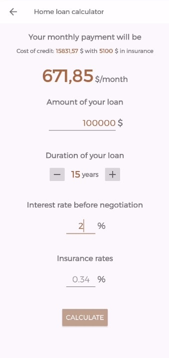

# OpenClassrooms - RealEstateManager

## Parcours développement d’application mobile - Projet 9

L’application RealEstateManager est un gestionnaire de biens immobiliers d'une agence.

1. [Requis](#requis)
2. [Objectifs](#objectifs)
3. [Technos utilisés](#technos)
4. [Installation de l’application](#installation)
5. [Application & Fonctionnalités](#application)

## Requis
Pour essayer cette application, il faut installer [Android Studio](https://developer.android.com/studio).

## Objectifs
Créer entièrement l’application à partir de "l'ébauche du stagiaire".

- Corriger les erreurs du stagiaire
- Mettre en place les classes modèles
- Mettre en place la base de données
- Mettre en place les 3 fragments (Liste, Carte, Profil)
- Utiliser la Localisation
- Utilisation de la Google Map API avec le SDK Maps pour android 
- Adapter sur tablette
- Exposer la base de données en lecture
- Tester

## Technos
- Language Kotlin 
- Architecture MVVM
- RXJava
- Room & DAO
- Map SDK
- Content Provider
- Mockito

## Installation

### Télécharger l’application

Le lien du projet est le suivant : git@github.com:Elyt622/RealEstateManager.git
Cliquez sur le bouton "Clone or Download"
Téléchargez le projet en cliquant sur "Download ZIP"
ou
### Cloner l'application
Cloner le projet à partir d'un terminal avec la commande: "git clone git@github.com:Elyt622/RealEstateManager.git"

### Installation
Importer le projet dans Android Studio
Lancer le projet

## Application

Les 3 fragments de l'application:
- La liste avec tous les biens immobiliers
- La carte avec tous les biens immobiliers representés par des marqueurs
- "Le profil" non demandé dans le projet

  
____________________
- On peut consulter le détail d'un bien en cliquant sur un marqueur de la carte, ou un élément de la liste
- Toutes les informations concernant le bien sont accessibles sur l'écran détail
- On a la possibilité de modifier le bien grâce au bouton "Modify property"

   
____________________
Dans la barre du haut, le bouton ouvre une fenêtre qui permet de filtrer les résultats obtenus sur la liste et la carte.

____________________

Dans la section profil, on peut cliquer sur le bouton "LoanSimulator" pour ouvrir l'activité qui nous permet de simuler un prêt immobilier.

____________________

La dernière fonctionnalité est l'ajout de bien immobilier en saisissant tous les détails correspondant à la propriété.

    

____________________

L'application est adaptée sur les tablettes grâce à l'utilisation des "Qualifiers". Sur la tablette, l'écran détail est à côté de la liste. En format paysage, les photos sont disponibles sur la droite de la photo principale.

 
